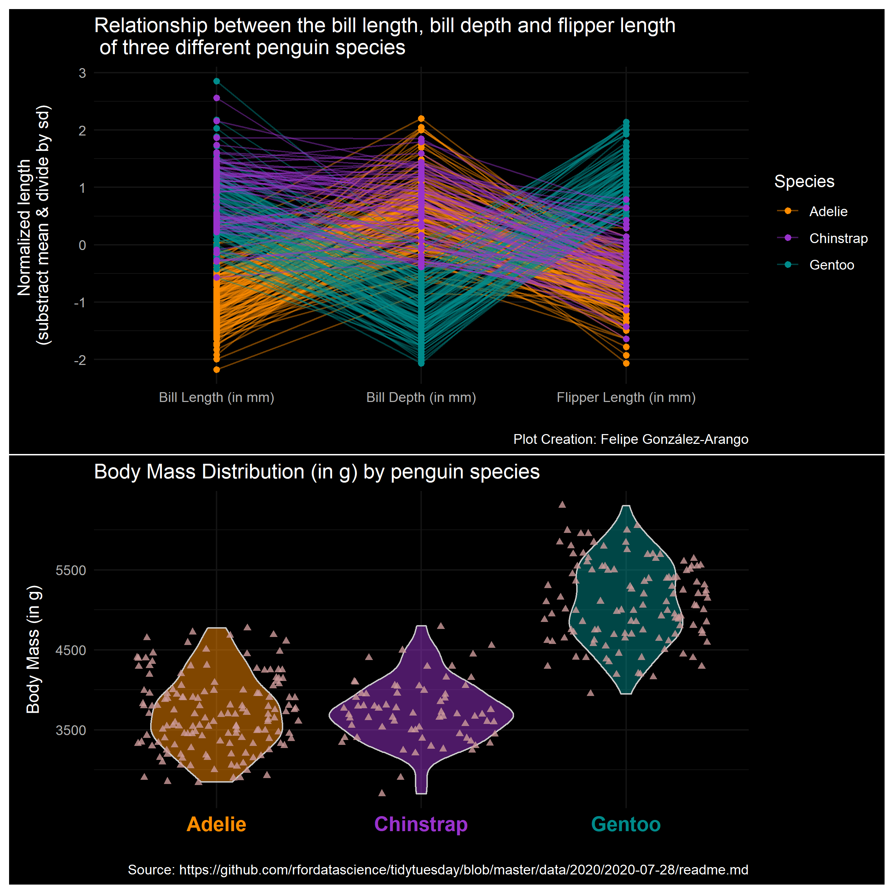

# Tidy Tuesday 2020 Week 31

This week we explored with the `GGally` package the `ggparcoord()` function that shows the relationship of multiple numeric variables (in this case we explored the bill length, bill depth and flipper lenght) of the three species of penguins. It's pretty nice. 

Penguin plot:

