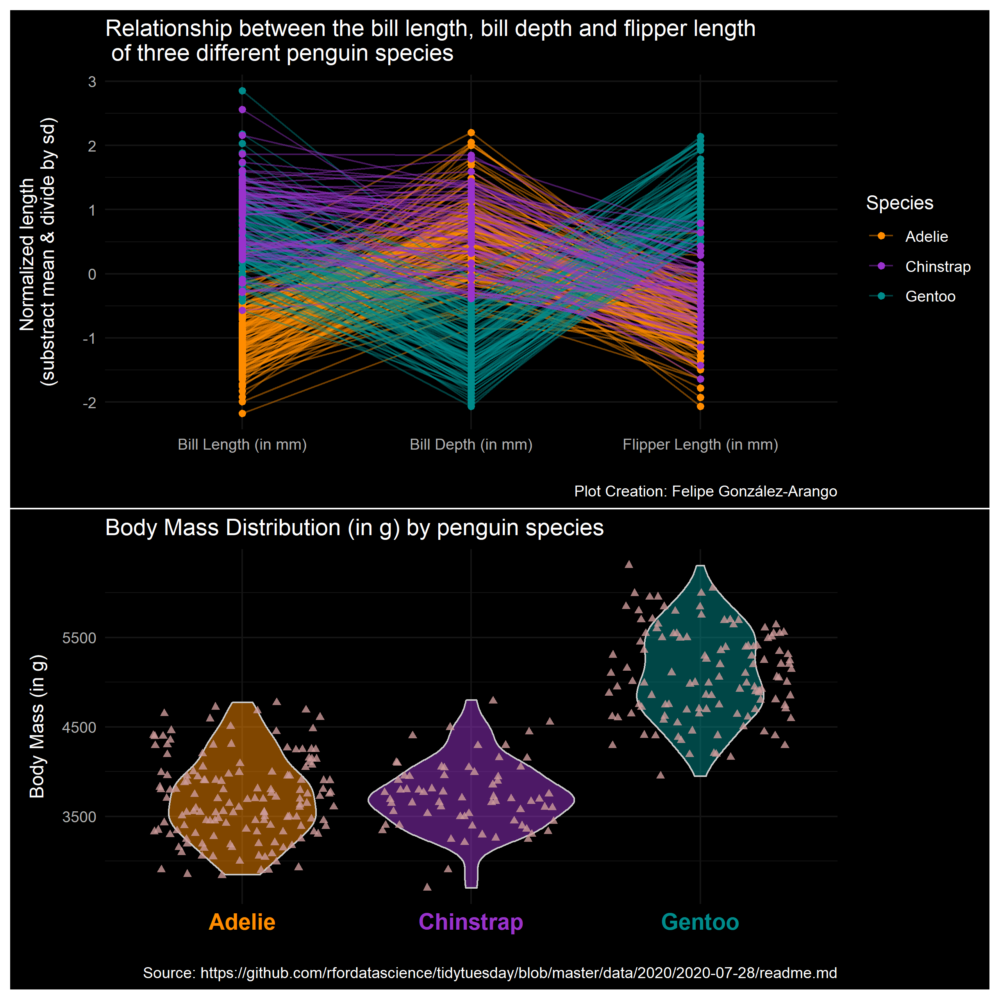
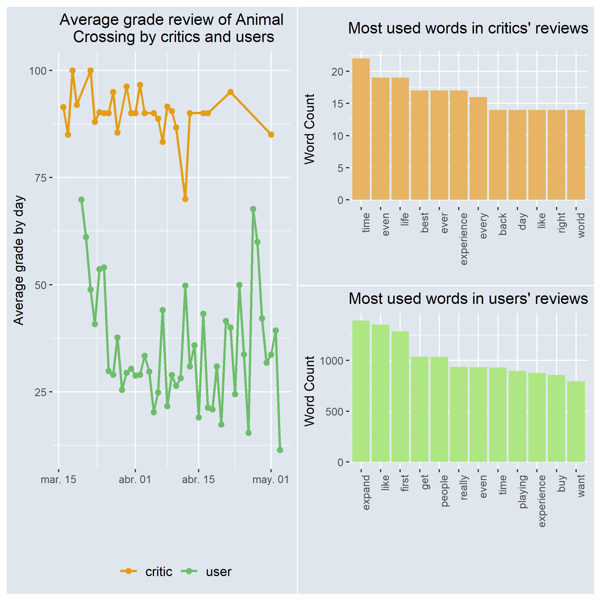

# Tidy Tuesday Contributions by Felipe González-Arango

  
Contributions in order with link to repo (click to expand)

<!-- toc -->
* **2020 Submissions**  
  - Contibution week 19 [Animal Crossing :cat: :hamster:](https://github.com/feligonza17/Tidy_Tuesday/tree/master/2020week19_animal_crossing)  
  - Contibution week 31 [Penguins :penguin:](https://github.com/feligonza17/Tidy_Tuesday/tree/master/2020week31_penguins)  
<!-- tocstop -->

## Contribuition 2 (2020week31): 

### Penguins! :penguin:

[CODE for Penguin plot](https://github.com/feligonza17/Tidy_Tuesday/blob/master/2020week31_penguins/penguins.Rmd)

## Contribuition 1 (2020week19): 

### Animal Crossing! :cat: :hamster: (plot)

[CODE for Animal Crossing Plot](https://github.com/feligonza17/Tidy_Tuesday/blob/master/2020week19_animal_crossing/animal_crossing.Rmd)

### Animal Crossing! :cat: :hamster: (word clouds)

